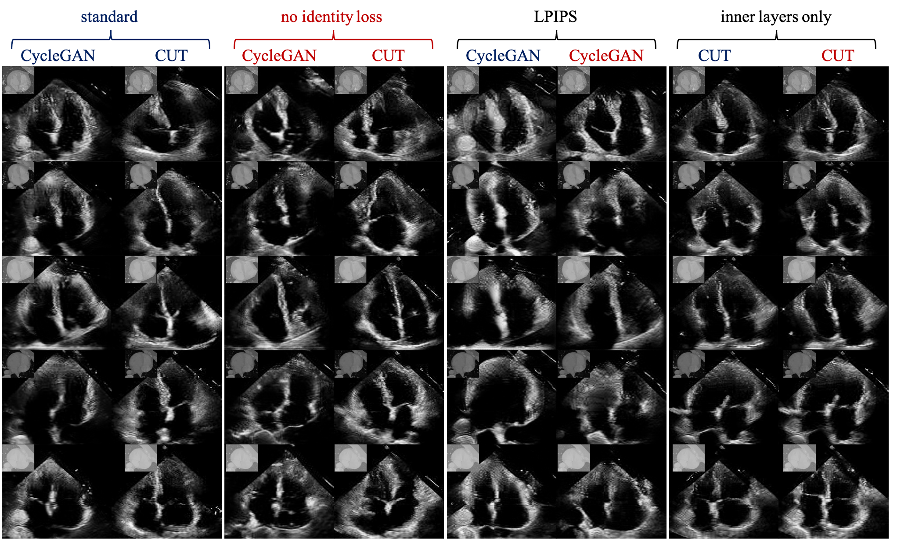

# Experiments for CycleGAN and Constrastive-Unpaired-Transaltion (CUT) baselines

Given that repo for CUT and CycleGAN is very well made, we can use most of their code to train two baselines for our project, one using CycleGAN and one using CUT. Results should not be groundbreaking but at the very least they should work. These will be used as baselines for future experiments in my Thesis.

# Dependencies

before running any experiment make sure you have all the dependencies needed.

```bash
python3 -m venv env
source env/bin/activate
pip install -r requirements.txt
```

# Results

Here are some examples of what we were able to achieve with these preliminary experiments, they will act as a baseline for future research.

<div align="center">
    <br>
	Fig 1: Diagram showing results of all described experiments, each column represents a different model and each row a different randomly sampled CT slice 	 from the test set. We color-coded experiment 2 outcomes such that models highlighted in blue where trained using the identity constraint, while models 		highlighted in red are not using this constraint. Each column block respectively reports results for experiments 1,2,3 and 4. The corresponding CT content 	   is embedded in the top left corner of each generated US.
</div><br><br>

# Logs

-there is a bug in CUT repo for grayscale -> grayscale translation. In data/unaligned_dataset.py line 67 replace: ```transform = get_transform(modified_opt)``` with ```transform = get_transform(modified_opt, grayscale = opt.input_nc == 1)```.
