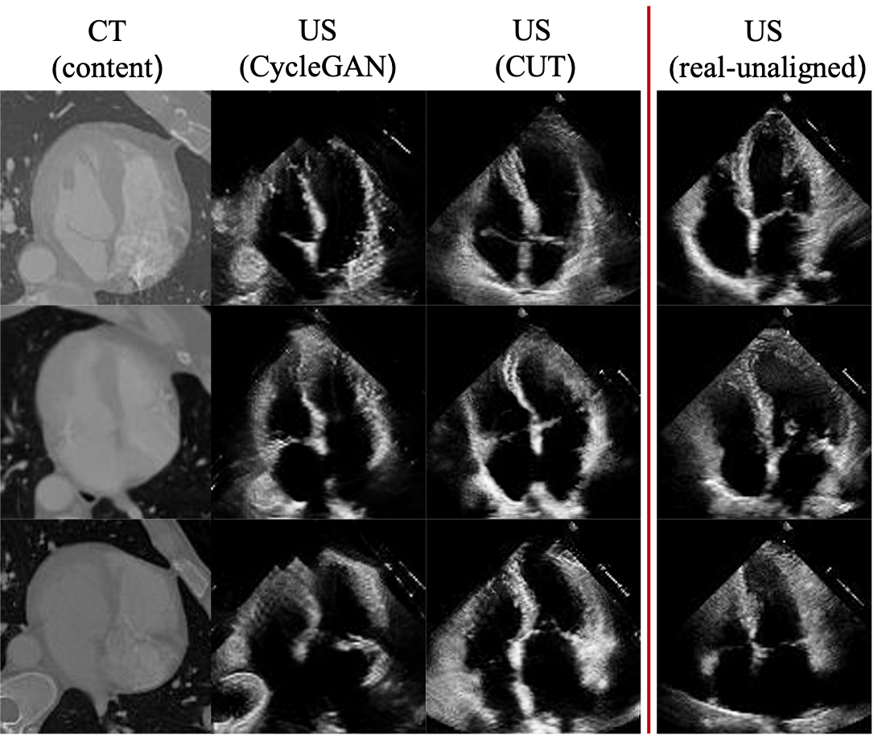

# Experiments for CycleGAN and Constrastive-Unpaired-Transaltion (CUT) baselines

Given that repo for CUT and CycleGAN is very well made, we can use most of their code to train two baselines for our project, one using CycleGAN and one using CUT. Results should not be groundbreaking but at the very least they should work. These will be used as baselines for future experiments in my Thesis.

# Dependencies

before running any experiment make sure you have all the dependencies needed.

CUT:
```bash
git clone https://github.com/taesungp/contrastive-unpaired-translation CUT
cd CUT
python3 -m venv env
source env/bin/activate
pip install -r requirements.txt
```

CycleGAN:
```bash
git clone https://github.com/taesungp/contrastive-unpaired-translation CycleGAN
cd CycleGAN
python3 -m venv env
source env/bin/activate
pip install -r requirements.txt
```

Pytorch-FID score library:

```bash
pip install pytorch-fid
```

# Results

Here are some examples of what we were able to achieve with these preliminary experiments, they will act as a baseline for future research.

<div align="center">
    <br>
	Fig 1: Diagram showing some synthetic US images from CT content using CUT and CycleGAN. They will act as a baseline for future experiments.
</div><br><br>

# Logs

-there is a bug in CUT repo for grayscale -> grayscale translation. In data/unaligned_dataset.py line 67 replace: ```transform = get_transform(modified_opt)``` with ```transform = get_transform(modified_opt, grayscale=True)```.
